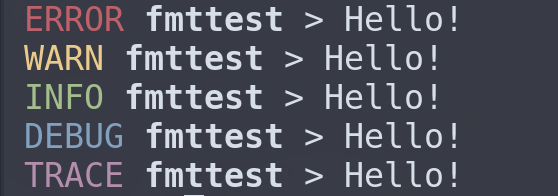

# Formats Collection
Here is the list of preset formats of fmtlog.

**WARNING: Log will not be colored when feature `colored` is missing.**

These formats can be used like this:
```rust
use fmtlog::Config;
use fmtlog::formats::SIMPLE1; // A format to use.

fmtlog::new(Config::new().format(SIMPLE1)).set().unwrap();

log::error!("Example Message");
log::warn!("Example Message");
log::info!("Example Message");
log::debug!("Example Message");
log::trace!("Example Message");
```

## SIMPLE1
A simplest format.


## SIMPLE1_LOWER
A simplest format. (lowercase version)


## SIMPLE2
A simplest format. (bracket version)


## SIMPLE2_LOWER
A simplest format. (bracket lowercase version)


## DETAIL1 (Requires feature: `chrono`)
A detailed version of [`SIMPLE1`](#simple1).


## DETAIL1_LOWER (Requires feature: `chrono`)
A detailed version of [`SIMPLE1_LOWER`](#simple1-lower).


## DETAIL2 (Requires feature: `chrono`)
A detailed version of [`SIMPLE2`](#simple2).


## DETAIL2_LOWER (Requires feature: `chrono`)
A detailed version of [`SIMPLE2_LOWER`](#simple2-lower).


## DEBUG1
A debug-specialized version of [`SIMPLE1`](#simple1).


## DEBUG1_LOWER
A debug-specialized version of [`SIMPLE1_LOWER`](#simple1-lower).


## DEBUG2
A debug-specialized version of [`SIMPLE2`](#simple2).


## DEBUG2_LOWER
A debug-specialized version of [`SIMPLE2_LOWER`](#simple2-lower).


## TOML (Requires feature: `chrono`)
Output logs as TOML format.


## YAML (Requires feature: `chrono`)
Output logs as YAML format.


### ENV_LOGGER (Requires feature: `chrono`)
The default format of [`env_logger`](https://docs.rs/env_logger).


### PRETTY_ENV_LOGGER
The default format of [`pretty_env_logger`](https://docs.rs/pretty_env_logger).



### FLEXI_LOGGER
The default format of [`flexi_logger`](https://docs.rs/flexi_logger) with timestamps.


### FLEXI_LOGGER2 (Requires feature: `chrono`)
The default(detailed) format of [`flexi_logger`](https://docs.rs/flexi_logger).


### SIMPLE_LOGGER (Requires feature: `chrono`)
The default format of [`simple_logger`](https://docs.rs/simple_logger).


### SIMPLELOG (Requires feature: `chrono`)
The default format of [`simplelog`](https://docs.rs/simplelog).


### STDERRLOG
The default format of [`stderrlog`](https://docs.rs/stderrlog).


### STDERRLOG2 (Requires feature: `chrono`)
The default format of [`stderrlog`](https://docs.rs/stderrlog) with timestamps.


